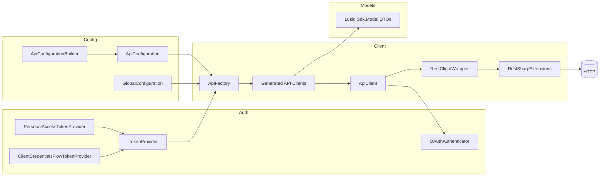

# Architecture overview

## Key takeaways
- API clients in `Lusid.Sdk.Api` implement `IApiAccessor`, and `ApiFactory` discovers and instantiates those APIs via reflection.  
  Evidence: `sdk/Lusid.Sdk/Api/AborApi.cs:L29-L32` and `sdk/Lusid.Sdk/Extensions/ApiFactory.cs:L34-L36`
- `ApiClient` constructs requests, applies configuration (headers, timeouts, OAuth), and executes via a RestSharp-based client wrapper.  
  Evidence: `sdk/Lusid.Sdk/Client/ApiClient.cs:L334-L454`
- Retry behavior is injected through `ApiFactory` using Polly retry policies (including rate-limit handling) when policies are not already set.  
  Evidence: `sdk/Lusid.Sdk/Extensions/ApiFactory.cs:L123-L145` and `sdk/Lusid.Sdk/Extensions/PollyApiRetryHandler.cs:L27-L182`

## High-level flow (Mermaid)

**Diagram evidence anchors**
- `ApiConfigurationBuilder` builds `ApiConfiguration`, and `ApiFactory` consumes it.  
  Evidence: `sdk/Lusid.Sdk/Extensions/ApiConfigurationBuilder.cs:L48-L60` and `sdk/Lusid.Sdk/Extensions/ApiFactory.cs:L40-L95`
- `ApiFactory` builds generated API instances and wires up `ExceptionFactory`/retry policies.  
  Evidence: `sdk/Lusid.Sdk/Extensions/ApiFactory.cs:L123-L165`
- `ApiClient` builds requests, uses `OAuthAuthenticator` when OAuth config is present, and executes via `RestClientWrapper`.  
  Evidence: `sdk/Lusid.Sdk/Client/ApiClient.cs:L334-L454` and `sdk/Lusid.Sdk/Client/ApiClient.cs:L200-L248`
- `RestSharpExtensions` maps SDK `Request`/`Response` to RestSharp equivalents.  
  Evidence: `sdk/Lusid.Sdk/Client/RestSharpExtensions.cs:L11-L187`
- Model DTOs live under `Lusid.Sdk.Model` (example: `ResourceListOfPortfolioTradeTicket`).  
  Evidence: `sdk/Lusid.Sdk/Model/ResourceListOfPortfolioTradeTicket.cs:L23-L31`

## Code generation notes
- Many SDK files include an OpenAPI Generator header, indicating generated code.  
  Evidence: `sdk/Lusid.Sdk/Client/ApiClient.cs:L1-L5` and `sdk/Lusid.Sdk/Api/AborApi.cs:L1-L5`

## Logging hooks and DI patterns
- Console logging appears in retry handling (e.g., `Console.WriteLine` in Polly retry callbacks).  
  Evidence: `sdk/Lusid.Sdk/Extensions/PollyApiRetryHandler.cs:L92-L104`
- **Dependency injection (DI) patterns:** Not found in repo. Verify by searching for `Microsoft.Extensions.DependencyInjection` or DI container registrations in the repo.  
  Evidence: Not found in repo. Verify by searching for DI usage across the codebase.
