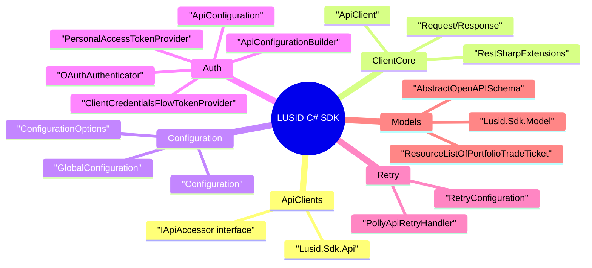

# Mind map

## Key takeaways
- The SDK centers around generated API clients, an `ApiClient` pipeline, and configuration/auth utilities in `Extensions`.  
  Evidence: `sdk/Lusid.Sdk/Api/AborApi.cs:L29-L62`, `sdk/Lusid.Sdk/Client/ApiClient.cs:L251-L512`, and `sdk/Lusid.Sdk/Extensions/ApiFactory.cs:L20-L165`

**Mind map anchors**
- API clients and interface: `sdk/Lusid.Sdk/Api/AborApi.cs:L29-L62` and `sdk/Lusid.Sdk/Client/IApiAccessor.cs:L12-L32`
- Client core pipeline: `sdk/Lusid.Sdk/Client/ApiClient.cs:L334-L512` and `sdk/Lusid.Sdk/Client/RestSharpExtensions.cs:L11-L187`
- Configuration surface: `sdk/Lusid.Sdk/Client/Configuration.cs:L23-L588` and `sdk/Lusid.Sdk/Client/GlobalConfiguration.cs:L44-L75`
- Auth/config builders: `sdk/Lusid.Sdk/Extensions/ApiConfiguration.cs:L15-L89` and `sdk/Lusid.Sdk/Extensions/ApiConfigurationBuilder.cs:L48-L163`
- Token providers: `sdk/Lusid.Sdk/Extensions/PersonalAccessTokenProvider.cs:L14-L52` and `sdk/Lusid.Sdk/Extensions/ClientCredentialsFlowTokenProvider.cs:L36-L186`
- OAuth authenticator: `sdk/Lusid.Sdk/Client/Auth/OAuthAuthenticator.cs:L17-L105`
- Retry policies: `sdk/Lusid.Sdk/Extensions/PollyApiRetryHandler.cs:L24-L299`, `sdk/Lusid.Sdk/Client/RetryConfiguration.cs:L13-L36`, and `sdk/Lusid.Sdk/Client/ApiClient.cs:L520-L613`
- Models: `sdk/Lusid.Sdk/Model/AbstractOpenAPISchema.cs:L14-L71` and `sdk/Lusid.Sdk/Model/ResourceListOfPortfolioTradeTicket.cs:L23-L86`
